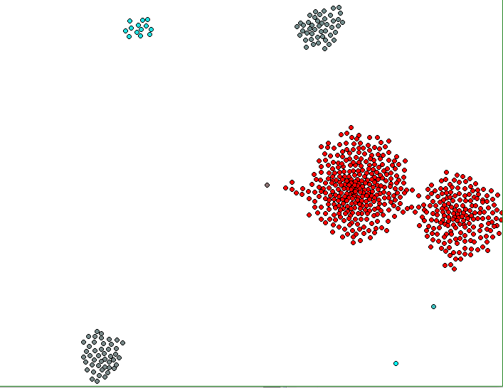
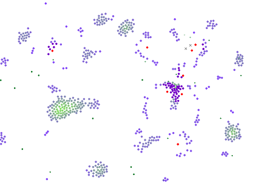

# Projektwerkstatt - Selbstorganisation in Natur und Gesellschaft
Kunst und Wissenschaft – Selbstorganisation in Natur und Gesellschaft
Anhand von Computersimulationen, audiovisueller Programmierung, Videoinstallationen
und Dokumentationen werden die Prinzipien der Selbstorganisation erforscht
und in eigenen Projekten nachempfunden.

# Projekt Schwarmsimulation
Im Zuge des Projektes wurde eine Agentensimulation zur Darstellung von Schwärmen erstellt.
Dazu wurden die 3 Regeln Craig Reynolds nachimplementiert:
- Bewege dich in Richtung des Mittelpunkts derer, die du in deinem Umfeld siehst
- Bewege dich weg, sobald dir jemand zu nahe kommt
- Bewege dich in etwa in dieselbe Richtung wie deine Nachbarn

Einen ersten Eindruck zur Umsetzung der genannten Bewegungsregeln. Desto mehr ein Agent mehrere Agenten zu seiner Bewegung einbezieht, ändert er seine Farbe von blau zu rot.

Nach der Umsetzung der einzelnen Bewegungsformen wurden, für eine Räuber-Beute-Simulation unterschiedliche Agententypen eingeführt.

